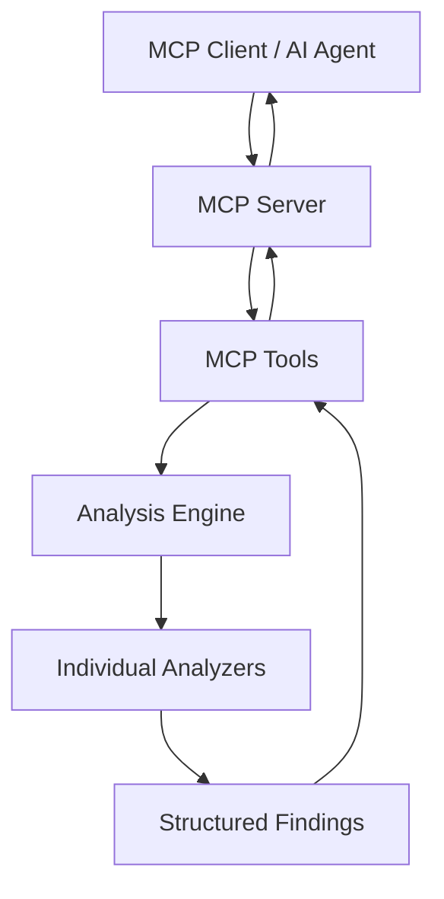

# ai-backend-performance-mcp

Static analysis MCP server for Node.js backend performance issues. AI agents can inspect a project for database query anti-patterns, async bottlenecks, connection pooling mistakes, and dependency hygiene problems — without modifying your code.

## Why this project?

Backend performance issues often hide in plain sight: N+1 queries in loops, clients created per request, sequential awaits that could run in parallel, or dependencies misclassified in `package.json`. This MCP server exposes those patterns as structured, evidence-backed findings that AI coding assistants can reason about.

**What it does**

- Read-only static analysis of JavaScript/TypeScript source files
- Six focused MCP tools for common backend performance categories
- Structured findings with severity, confidence, code snippets, and recommendations
- Distinguishes **confirmed** evidence from **potential** issues

**What it does not do**

- Execute your application or repository code
- Modify files, install packages, or change indexes
- Replace profiling, load testing, or database `EXPLAIN` analysis

## Architecture



See [docs/architecture.md](docs/architecture.md) for layer details.

## Analyzers

| Analyzer | Detects |
|----------|---------|
| Database queries | N+1 patterns, unbounded finds/queries |
| MongoDB indexes | Filter/sort fields without matching `createIndex` |
| Async patterns | `await` in loops, sequential awaits, blocking sync ops |
| Connection pooling | Client/pool creation in handlers or loops |
| Dependencies | Unused deps, dev/prod misclassification, lockfile stats |

## MCP Tools

| Tool | Description |
|------|-------------|
| `analyze_project` | Full scan with grouped findings and summary |
| `analyze_database_queries` | MongoDB/PostgreSQL query patterns |
| `analyze_indexes` | MongoDB index coverage heuristics |
| `analyze_async_patterns` | Async/await performance patterns |
| `analyze_connection_pooling` | Connection lifecycle anti-patterns |
| `analyze_dependencies` | `package.json` / lockfile hygiene |

Tool reference: [docs/tools.md](docs/tools.md)

## Installation

```bash
npm install ai-backend-performance-mcp
```

Or run directly:

```bash
npx ai-backend-performance-mcp
```

## MCP configuration

Add to your MCP client config (example for Cursor / Claude Desktop):

```json
{
  "mcpServers": {
    "backend-performance": {
      "command": "npx",
      "args": ["-y", "ai-backend-performance-mcp"],
      "env": {}
    }
  }
}
```

For local development:

```json
{
  "mcpServers": {
    "backend-performance": {
      "command": "node",
      "args": ["/absolute/path/to/ai-backend-performance-mcp/dist/index.js"]
    }
  }
}
```

## Usage

Invoke any tool with a `projectPath` pointing to a Node.js backend repository:

```json
{
  "projectPath": "/path/to/your/api"
}
```

### Example output (truncated)

```json
{
  "projectPath": "/app/examples/sample-node-api",
  "technologies": ["express", "mongodb"],
  "metadata": {
    "packageName": "sample-node-api",
    "packageVersion": "1.0.0",
    "sourceFileCount": 4
  },
  "findings": [
    {
      "category": "pooling",
      "severity": "critical",
      "title": "Connection or client created in request handler",
      "evidence": {
        "kind": "confirmed",
        "snippet": "const client = await MongoClient.connect(...)"
      },
      "confidence": 0.9,
      "recommendation": "Create a shared client/pool at module scope and reuse it."
    }
  ],
  "summary": {
    "totalFindings": 6,
    "confirmedCount": 3,
    "potentialCount": 3
  }
}
```

Try the included demo project at [examples/sample-node-api](examples/sample-node-api).

## Safety

- **Read-only**: never writes to analyzed projects
- **Path validation**: prevents traversal outside `projectPath`
- **No code execution**: parses source text only; does not run repository code
- **Untrusted input**: treat analyzed repos as untrusted

## Limitations

- Static analysis only; may produce false positives (marked as `potential`)
- Dynamic `require()` / runtime-generated queries are not fully tracked
- Index analysis compares in-repo `createIndex` calls only (not Atlas/ops-managed indexes)
- Dependency unused detection is import-scan based
- Redis-specific rules are planned but not implemented in v0.1.0

## Development

```bash
git clone https://github.com/robinafaruqia/ai-backend-performance-mcp.git
cd ai-backend-performance-mcp
npm install
npm run typecheck
npm run lint
npm test
npm run build
```

See [docs/development.md](docs/development.md).

## Testing

```bash
npm test
```

Fixture projects under `tests/fixtures/` cover N+1 queries, await-in-loop, sequential awaits, connection-in-handler, index mismatch, and dependency issues.

## Roadmap

- [ ] Redis/cache analyzer
- [ ] Prisma/TypeORM-specific query rules
- [ ] ProjectContext caching
- [ ] SARIF/JSON report export
- [ ] Configurable severity thresholds

## Contributing

Contributions are welcome! See [CONTRIBUTING.md](CONTRIBUTING.md) and [CODE_OF_CONDUCT.md](CODE_OF_CONDUCT.md).

## License

MIT — see [LICENSE](LICENSE).
