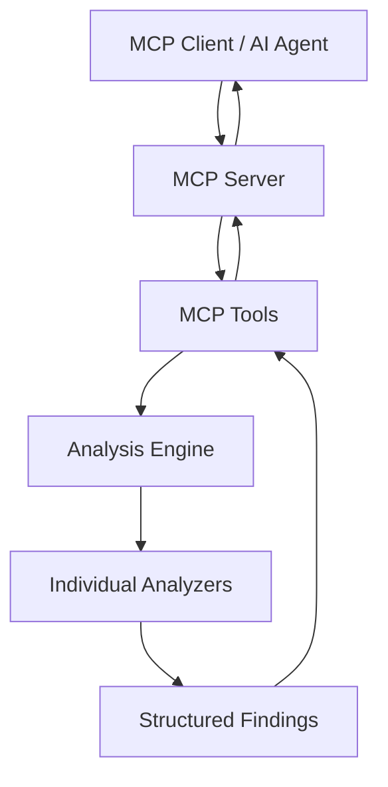

# Architecture

## Overview

`ai-backend-performance-mcp` follows a strict layered architecture where the MCP server exposes tools, tools delegate to the analysis engine, and analyzers produce structured findings.

## Layers

### MCP Server (`src/server/`)

- Registers six analysis tools
- Handles stdio transport
- Contains no analysis logic

### MCP Tools (`src/tools/`)

- Validate input (`projectPath`)
- Load `ProjectContext` via the analysis engine
- Invoke specific analyzers
- Format JSON responses for MCP clients

### Analysis Engine (`src/analysisEngine.ts`)

- Loads project context (package.json, source files, detected technologies)
- Orchestrates analyzer execution
- Designed for future caching of `ProjectContext`

### Analyzers (`src/analyzers/`)

| Analyzer | Focus |
|----------|-------|
| `databaseQueryAnalyzer` | MongoDB/PostgreSQL query anti-patterns |
| `indexAnalyzer` | MongoDB index coverage |
| `asyncPatternAnalyzer` | Await in loops, sequential awaits, blocking ops |
| `connectionPoolAnalyzer` | Client/pool creation in hot paths |
| `dependencyAnalyzer` | package.json and lockfile hygiene |

### Parsers & Utilities

- `parsers/packageJson.ts` — dependency and technology detection
- `parsers/sourceFiles.ts` — safe, read-only source file collection
- `analyzers/ast/astUtils.ts` — TypeScript AST helpers

## Safety

All analysis is **read-only**. The engine never modifies source files, installs dependencies, or executes repository code.

## Extensibility

Add a new analyzer by:

1. Implementing the `Analyzer` interface
2. Registering it in `AnalysisEngine` default analyzers
3. Optionally exposing a dedicated MCP tool
